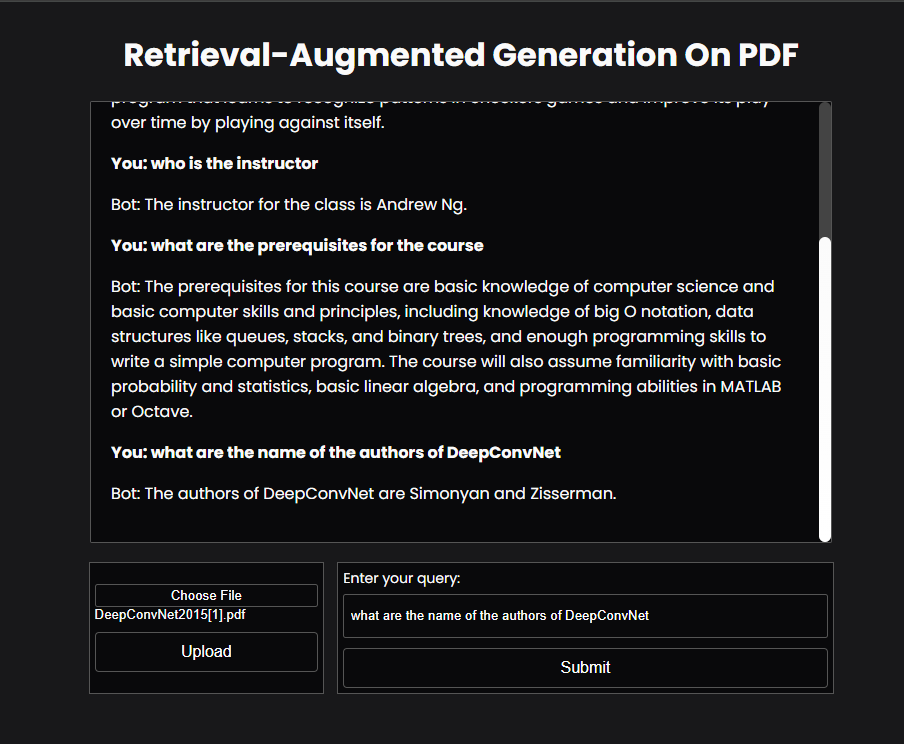

# Retrieval-Augmented Generation with Mistral AI and Flask on PDF

## Preview



## Overview

This project demonstrates Retrieval-Augmented Generation using Mistral AI and Flask. It integrates Flask for the user interface, requests for handling data, and Mistral AI for LangChain with LLM (Large Language Model).

## Requirements

To run the application, please ensure you have all the required dependencies installed. You can install them using the provided `requirements.txt` file.

You will also need a hugging face token which you can easliy find on your huggingface profile

### Installation

1. Clone the repository:

    ```sh
    git clone https://github.com/kiritoInd/RAG_over_LLM_for_pdf_ChatBot.git
    cd ChatBot-With-LangChain
    ```

2. Install the required packages:

    ```sh
    pip install -r requirements.txt
    ```

3. Enter your Hugging Face Token

## Running the Application

To start the Flask server, run the `app.py` file:

```sh
python app.py
```

## Project structure

```
RAG_On_PDF_ChatBot/
├── app.py
├── requirements.txt
├── env.example 
├── templates/
│   └── index.html
└── static/
    └── styles.css
```

- **app.py**: The main Flask application.
  
- **requirements.txt**: Contains the list of dependencies.
  
- **templates/index.html**: The HTML template for the chatbot interface.
  
- **static/styles.css**: The CSS file for styling the chatbot interface.

## Usage

1. Open your web browser and navigate to [http://127.0.0.1:5000/](http://127.0.0.1:5000/).
2. Upload your Pdf file
3. Enter your query in the input box and submit.
4. The chatbot will process your query and display the results.
5. You can ask follow up quetion 

## Contributing

If you want to contribute to this project, feel free to fork the repository and submit a pull request.

## License

This project is licensed under the MIT License.
